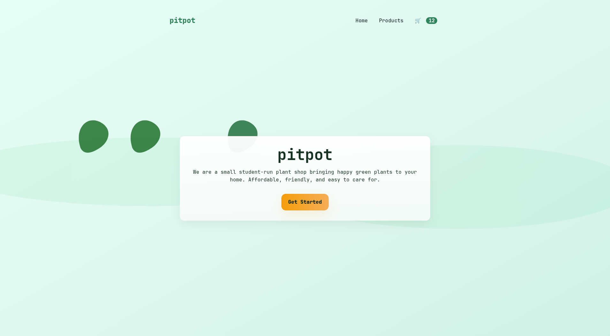
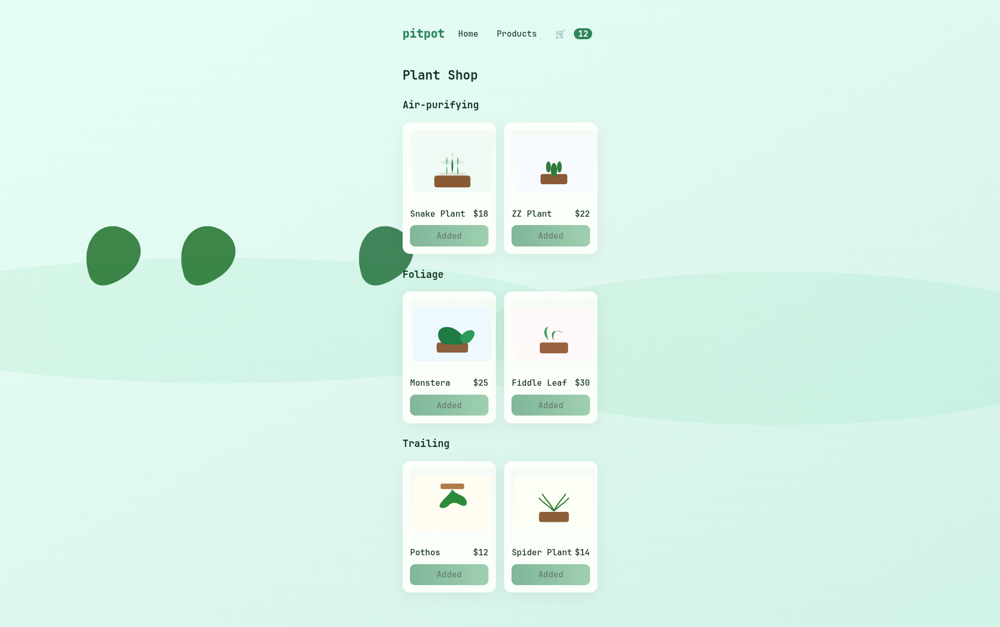
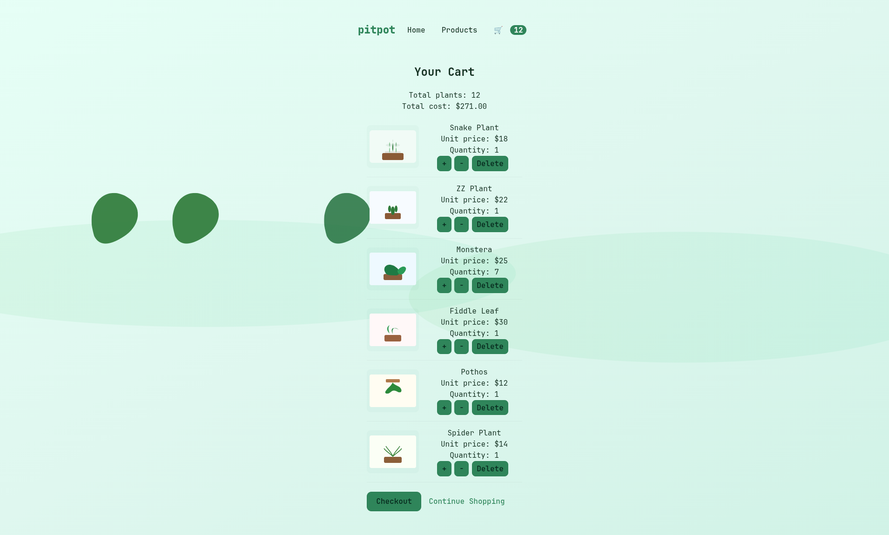

# pitpot — Plant Shop (for Coursera certificate)

This is a small project implemented with Vite + React for a Coursera front-end certificate assignment. The app is a minimal e-commerce demo for houseplants with a landing page, product listing, and shopping cart.

Project highlights

- Landing page with company name `pitpot`, a background image, a short paragraph, and a "Get Started" button linking to the product listing.
- Product listing of 6 unique houseplants, grouped into categories, each showing thumbnail, name, price and an "Add to Cart" button.
- Global cart state using React Context, with a header cart icon that shows the total item count.
- Shopping cart page showing each item with thumbnail, name, unit price, quantity controls (increase/decrease), delete, totals, and checkout (placeholder "Coming Soon").
- Built with accessibility and simple responsive layout in mind.

Rubric mapping

- Landing page (5 points)
  - Background image: yes
  - Paragraph: yes
  - Company name: `pitpot` shown
  - Get Started button links to products

- Product listing page (9 points)
  - 6 unique plants with thumbnail, name, price
  - Grouped into 3+ categories
  - Add to Cart button: increments header count, disables after add, adds item to cart

- Header (7 points)
  - Header displayed across pages
  - Shopping cart icon with item count
  - Navigation links to Home, Products, Cart

- Shopping Cart page (23 points)
  - Totals for number of plants and total price
  - Each plant shows thumbnail, name, unit price
  - Increase / decrease buttons update qty and totals
  - Delete button removes an item
  - Checkout button shows "Coming Soon"
  - Continue shopping link back to products

How to run locally

Requirements: Node and npm installed

Install dependencies:
```
npm install
```

Run the dev server:
```
npm run dev
```

Build for production:
```
npm run build
```

Preview the production build:
```
npm run preview
```

Deployment (GitHub Pages)

This project includes a GitHub Actions workflow to build and deploy to GitHub Pages. Configure your repository settings and ensure the action has permission to publish.

Screenshots

Add your screenshots here before submission to Coursera.

- Landing page
  

- Products page
  

- Cart page
  

